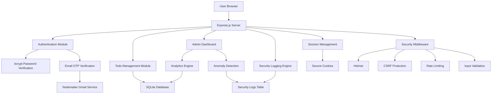

# Secure Todo Management System

## Overview

The Secure Todo Management System is a cybersecurity-focused web application built using Node.js, Express.js, SQLite, and EJS. The project began as a basic task manager and evolved into a security-enhanced platform implementing modern authentication, monitoring, and defensive security practices.

The application demonstrates secure coding principles, authentication workflows, anomaly detection, admin monitoring, Docker deployment, and production-style session handling.

---

# Features

## User Features

* User registration and login
* Email-based OTP Multi-Factor Authentication (MFA)
* Secure session management
* Todo/task creation and management
* Task completion tracking
* Personal dashboard analytics

---

## Security Features

### Authentication & Authorization

* Password hashing using bcrypt
* Session-based authentication
* Role-Based Access Control (RBAC)
* Admin-only protected routes
* Email OTP verification using Nodemailer

### Web Security

* CSRF protection
* Secure cookies
* HTTP-only cookies
* SameSite cookie protection
* Rate limiting against brute-force attacks
* Helmet security headers
* Input validation and sanitization

### Monitoring & Detection

* Security event logging
* Failed login detection
* OTP failure detection
* Unauthorized access detection
* Suspicious activity analytics
* Admin security dashboard

---

# Tech Stack

| Technology         | Purpose                |
| ------------------ | ---------------------- |
| Node.js            | Backend Runtime        |
| Express.js         | Web Framework          |
| SQLite             | Database               |
| EJS                | Frontend Templates     |
| bcrypt             | Password Hashing       |
| express-session    | Session Management     |
| connect-sqlite3    | Session Storage        |
| csurf              | CSRF Protection        |
| helmet             | HTTP Security Headers  |
| express-rate-limit | Rate Limiting          |
| Nodemailer         | Email OTP Delivery     |
| Speakeasy          | OTP Generation         |
| Chart.js           | Admin Analytics Charts |
| Docker             | Containerization       |

---

# Security Architecture

## Authentication Flow

```text
User Login
    ↓
Password Validation
    ↓
OTP Generation
    ↓
OTP Sent via Email
    ↓
OTP Verification
    ↓
Session Creation
    ↓
Access Granted
```

---

# System Architecture Diagram



---

# Admin Dashboard Analytics

The admin panel provides:

* Total users
* Total admins
* Total tasks
* Completed tasks
* Pending tasks
* Failed login attempts
* OTP failures
* Unauthorized access attempts
* Suspicious activity monitoring
* Security logs table
* Real-time analytics charts

---

# Anomaly Detection Logic

The application detects suspicious behavior patterns including:

* Multiple failed login attempts
* Repeated invalid OTP attempts
* Unauthorized admin access attempts
* Suspicious activity trends from logs

These events are visualized in the admin dashboard.

---

# Docker Deployment

## Build Docker Image

```bash
docker build -t secure-todo-app .
```

## Run Container

```bash
docker run -p 3000:3000 secure-todo-app
```

---

# Environment Variables

Create a `.env` file:

```env
EMAIL_USER=your_email@gmail.com
EMAIL_PASS=your_app_password
SESSION_SECRET=your_secret_key
```

---

# Future Improvements

* Password reset workflow
* Account lockout mechanism
* Password complexity enforcement
* Cloud deployment
* CI/CD pipeline
* SIEM integration
* JWT-based authentication
* Advanced anomaly scoring

---

# Learning Outcomes

This project demonstrates:

* Secure web development
* Authentication system design
* Session security
* Security monitoring
* Defensive programming
* Docker deployment
* Admin analytics engineering
* Cybersecurity-focused application development

---

# Author

Developed as a cybersecurity-focused secure web application project using Node.js and Express.js.
